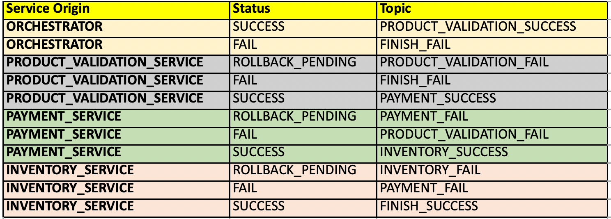
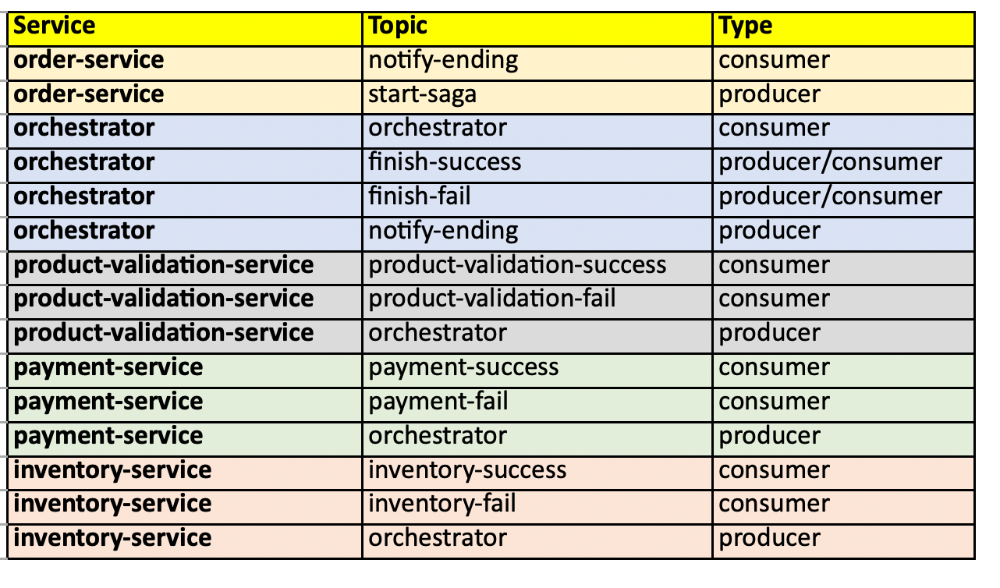

# 🧩 Saga Orchestration Microservices Architecture – README

## 🧾 Project Overview

This project implements a distributed microservices architecture based on the **Saga Pattern**, designed to handle complex transactions across multiple services. The architecture uses event-driven communication and central orchestration to ensure consistency, traceability, and reliability across all operations.

---

## 🔀 Services Overview

### 🛒 **Order-Service**
- Exposes REST endpoints to initiate orders.
- Stores initial order data and the events received.
- Database: **MongoDB**.

### 🧠 **Orchestrator-Service**
- Central brain of the system.
- Responsible for directing the saga flow: it tracks which services have been executed and manages transitions to the next.
- Saves the orchestration process state.
- Stateless (no database).

### 🧾 **Product-Validation-Service**
- Validates whether ordered products exist and are valid.
- Stores validation results per order ID.
- Database: **PostgreSQL**.

### 💳 **Payment-Service**
- Calculates and processes the payment based on order quantity and unit price.
- Stores payment status.
- Database: **PostgreSQL**.

### 📦 **Inventory-Service**
- Updates inventory by subtracting ordered quantities.
- Stores product quantity debits for each order.
- Database: **PostgreSQL**.

---

## 🧠 Saga Orchestration Flow

The saga follows a strict flow defined and controlled by the **Orchestrator-Service**. Each step emits and listens to events via message brokers
### 🖼️ Architectural Drawing


### 🖼️ Saga Orchestration Diagram


### 🖼️ Service Topics / Communication


---

## 🐳 Running the Project with Docker Compose

Make sure you have Docker and Docker Compose installed.

### ▶️ Start the System
```bash
docker-compose up --build
```

This will spin up all services, including MongoDB and PostgreSQL databases.

---

## 🌐 API Access & Documentation

Each microservice exposes its own API (typically via Swagger UI):

- Order Service: [http://localhost:8081/swagger-ui.html](http://localhost:8081/swagger-ui.html)
- Orchestrator: [http://localhost:8082/swagger-ui.html](http://localhost:8082/swagger-ui.html)
- Product Validation: [http://localhost:8083/swagger-ui.html](http://localhost:8083/swagger-ui.html)
- Payment Service: [http://localhost:8084/swagger-ui.html](http://localhost:8084/swagger-ui.html)
- Inventory Service: [http://localhost:8085/swagger-ui.html](http://localhost:8085/swagger-ui.html)

---

## 📦 Technologies Used

- Java 21
- Spring Boot
- MongoDB & PostgreSQL
- Docker & Docker Compose
- Event-driven architecture (Kafka or RabbitMQ)
- OpenAPI (Swagger)

---


---

## ✅ Author
Pedro Santos

> This architecture provides a robust and scalable foundation for distributed transaction management using the Saga pattern.

